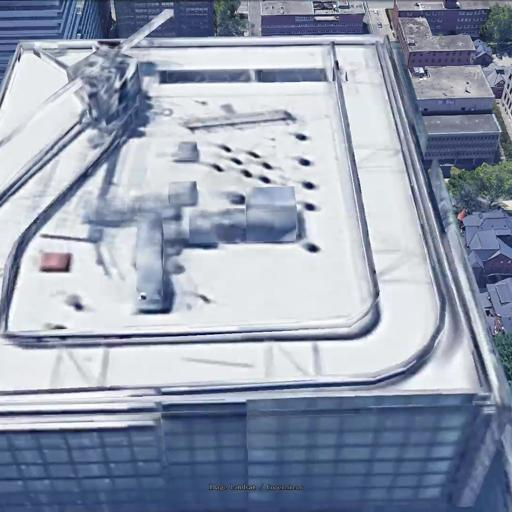
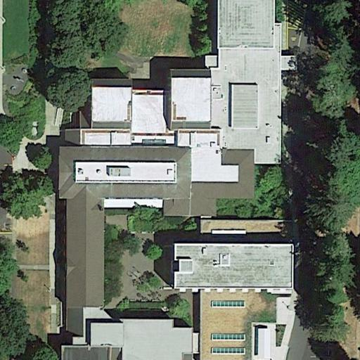
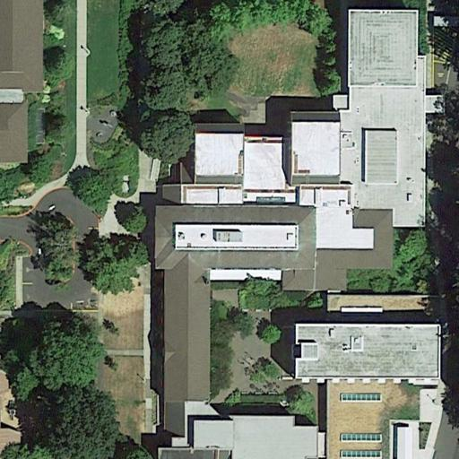

## Some improvements

1. Clean training dataset: delete some noisy datas. 

- Occlusion 1440/image-09:

- Similar galleries 0975 and 1002:

 

2. Modify model and training process:
- Use triplet loss to directly supervise the image embeddings , instead of the features output from the fourth layer of the backbone.
- Modify the process of concatenating features with different scales.
- Increase the penalty of triplet loss (10x).
