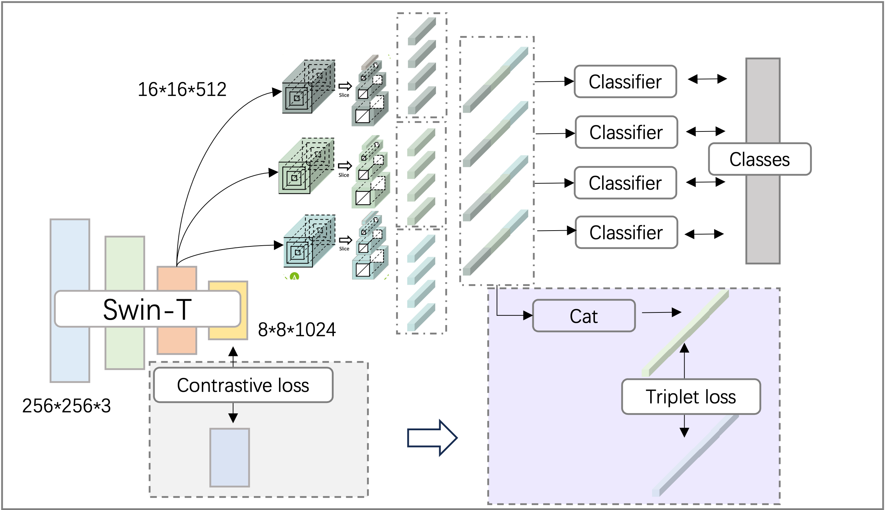

# Seven-Day Challenge

Comepition Site: https://codalab.lisn.upsaclay.fr/competitions/12672#learn_the_details-overview

Official Repo: https://github.com/layumi/ACMMM2023Workshop

Open-source Codes: https://github.com/layumi/UAVM2023

Baseline: https://github.com/layumi/University1652-Baseline/tree/master

## Candidates:

1. https://github.com/Skyy93

2. https://github.com/lzfff12

3. https://github.com/Xenogenesis1/MLPN_workshop
    - SwinT + Multi-scale LPN (https://github.com/wtyhub/LPN) + CE + InfoNCE

4. https://github.com/HuHu246/DPN
    - ResNet + LPN + CE

5. https://github.com/BingY998/UAVCompetition_WorkShop2023

## Useful Sources:

1. https://github.com/NEU-Gou/awesome-reid-dataset
2. https://github.com/cvg/Hierarchical-Localization
3. awesome Geo-localization: https://github.com/layumi/University1652-Baseline/tree/master/State-of-the-art#cvusa-dataset

## Experiments

| Method                    | Eval/Recall@1  | Test/Recall@1 |
| ------------------------- | -------------  | ------------- |
| [MLPN](https://github.com/Xenogenesis1/MLPN_workshop)                      | 95.46          | 92.14         |
| [CrossView](https://github.com/mode-str/crossview)                 | 88.89          | --            |
| MLPN_clean (baseline)     | 94.66          | 92.26         |
| MLPN_rerank               | 91.43          | --            |
| MLPN_finetune_1           | 94.18          | 92.46         |
| MLPN_finetune_2           | 95.79          | 93.56         |
| MLPN_finetune_eval        | --             | 97.88         |

MLPN_clean: train MLPN on the training dataset with noisy samples removed

MLPN_finetune_1: adopt triplet loss to supervise the image embedding.

MLPN_finetune_2: adopt triplet loss to supervise the image embedding, CE loss to supervise classifier.

MLPN_finetune_eval: introduce extra evaluating dataset to train model, data leak warning.

 

## Inspirations:

1. Apply reranking: [Correlation Verification for Image Retrieva](https://openaccess.thecvf.com/content/CVPR2022/html/Lee_Correlation_Verification_for_Image_Retrieval_CVPR_2022_paper.html)

2. Find regions of intrest: [TransGeo: Transformer Is All You Need for Cross-view Image Geo-localization](https://openaccess.thecvf.com/content/CVPR2022/html/Zhu_TransGeo_Transformer_Is_All_You_Need_for_Cross-View_Image_Geo-Localization_CVPR_2022_paper.html)

3. Bag of tricks: 
- [Efficient large-scale image retrieval with deep feature orthogonality and Hybrid-Swin-Transformers](https://arxiv.org/abs/2110.03786)
- [2nd Place Solution to Google Landmark Retrieval 2021](https://arxiv.org/abs/2110.04294)

 